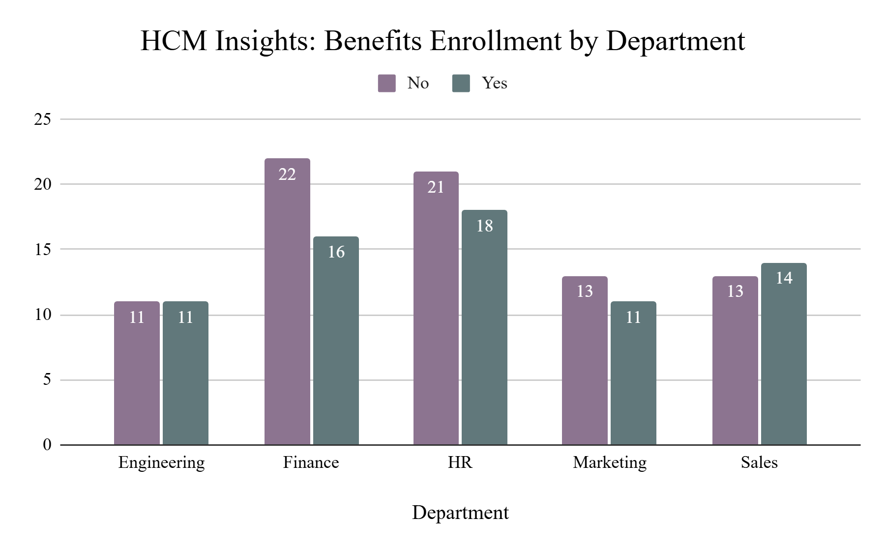
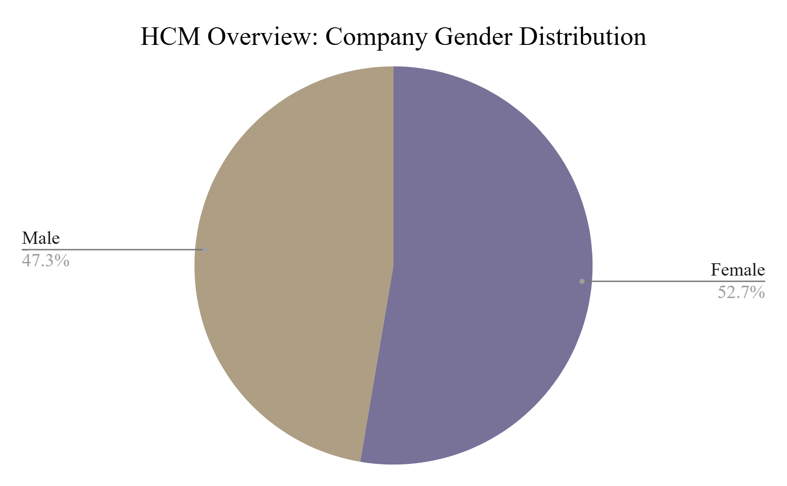
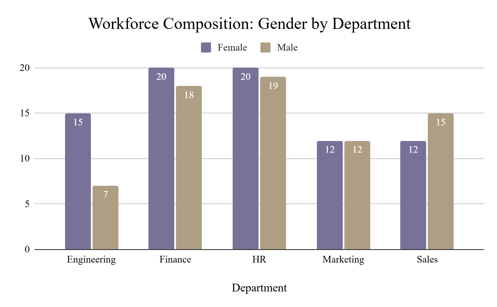
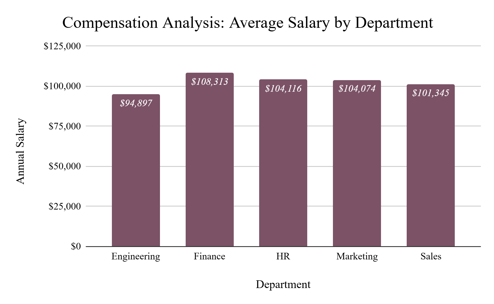

# 📊 Simulated HCM Reporting: Oracle-Style HR Dashboards 📝

This project simulates key reporting features of Oracle HCM Cloud using a synthetic HR dataset. Designed to reflect the responsibilities of an IBM Application Package Specialist, it demonstrates business analysis, HR process understanding, and BI-style dashboard creation.

### What This Simulates
- HR analytics reports commonly found in Oracle HCM Cloud or OTBI
- Department-level breakdowns of workforce composition and benefits participation
- Executive-style dashboards used by HR and business leaders

### Included Dashboards
#### 1. HCM Insights: Benefits Enrollment by Department
Stacked column chart showing enrollment status across business units.

#### 2. HCM Overview: Company Gender Distribution
Pie chart showing gender representation across the organization.

#### 3. Workforce Composition: Gender by Department
Bar chart comparing male vs. female headcount by department.

#### 4. Compensation Analysis: Average Salary by Department
Vertical bar chart showing average annual salary across departments.

### Tools & Skills
- Google Sheets / Excel: Pivot tables, data visualization, styling

- Python & Faker: Generated realistic HR dataset with job, salary, gender, and benefits fields

- HR Business Insight: Translated raw data into dashboards for benefits, pay, and workforce composition

- Simulated OTBI Reporting: Mimicked Oracle HCM-style analytics for decision support
